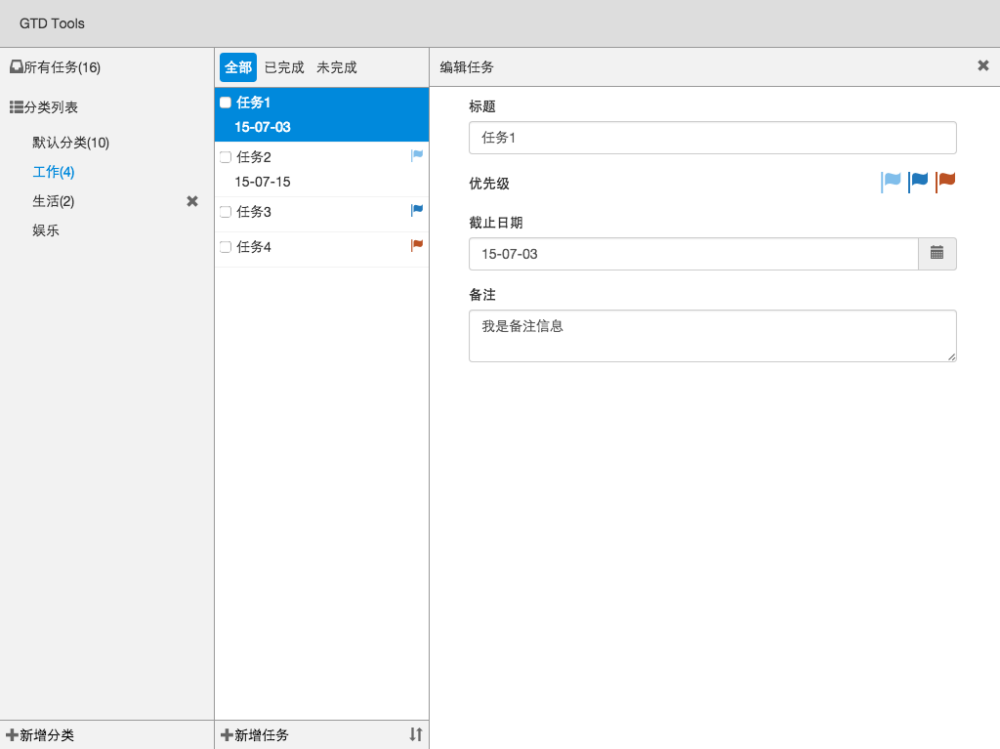
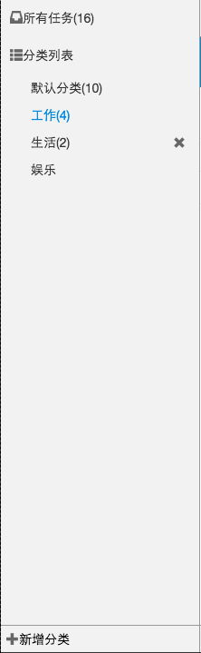
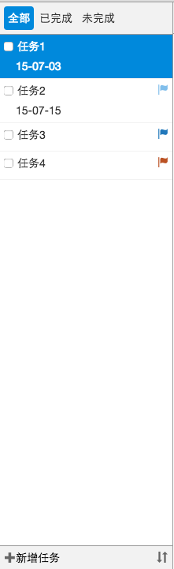
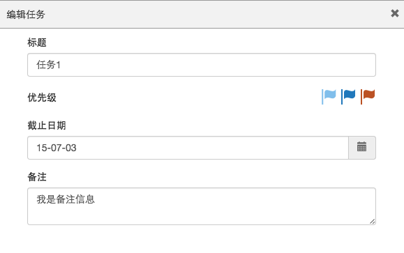

# Angular初步学习

最终的挑战需要使用Angular.js来完成，如果你对Angular.js非常熟悉，可以跳过这个教程，直接去做题。
 
请阅读此教程来学习Angular.js：[Recipes with Angular.js](http://fdietz.github.io/recipes-with-angular-js/index.html)

阅读顺序：

- Introduction
- Controllers
- Directives
- Filters
- Consuming External Services(可以只阅读Consuming RESTful APIs、Deferred and Promise)
- Urls Routing and Partials

# 综合挑战

这是一个比TodoMVC稍复杂的挑战，Todo具有分类，拥有多个属性。

建议学习时间：2个工作日。

# 数据结构

这个例子里面，应该只包括两种类型的数据，Category和Todo。

Category拥有的字段如下：

- 标题：显示的分类名，必填。

Todo拥有的字段如下：

- 标题: 字符串类型，必填
- 备注: 字符串类型，选填。
- 截止日期：Date类型，选填。
- 优先级：可选值1、2、3，数字类型，默认值为null。
- 是否完成：boolean类型，默认值为false。
- 添加日期：Date类型，在创建的时候必填。

# 需求文档

从视觉上来看，我们可以把这个任务分成『分类列表』、『任务列表』、『任务表单』三个部分，我们从这三个方面来讲这个任务需要实现的功能。

## 分类

分类的需求如下：

- 点击『所有分类』，则显示『任务列表』所有分类下的任务。
- 点击分类列表中的其他分类，则『任务列表』显示该分类下的任务。
- 每一个分类名字后需要该分类下未完成的任务数目，如果没有则不显示。
- 除『所有任务』、『默认分类』外，鼠标移动到分类上，则在右侧显示一个『删除按钮』，点击则询问用户是否删除该分类，如果确认则删除该分类和该分类下的所有任务。
- 点击底部的『新增分类』按钮，则弹出一个prompt，让用户输入分类名；如果分类名不为空，则增加到分类列表的尾部。
 
选做需求：

- 双击分类的标题名，则可以编辑分类。
- 如果有余力，可以实现一个类似prompt的弹出层。

## 任务列表
任务列表的主要功能是对任务进行过滤、排序、新增、选择，具体效果见下图。

### 任务的显示

任务列表应该默认按照『添加日期』降序排列，如果用户修改过排序规则，则按照用户定义的规则排序。

在任务列表上只需要显示：『标题』、『是否完成』、『优先级』、『截止日期』。

- 用户点击Checkbox后需要标记该任务已经完成。
- 用户选中某个任务之后，高亮该任务，『任务表单』则显示该任务的信息。
- 用户设置了优先级之后，需要在右侧用Flag显示该任务的优先级。
- 用户设置了截止时间之后，需要在标题下方显示截止时间。
- 用户点击了『新增任务』按钮之后，任务列表中插入一个新的任务并选中。如果当前的分为为『所有任务』，则新建任务的分类为『默认分类』。
- 用户了切换了『任务分类』之后，当前任务需要重置为空，右侧的『任务表单』也需要提示用户『请选择一个任务』。

### 过滤

任务列表在客户端可以根据任务的状态进行过滤，分为『全部』、『已完成』、『未完成』。

这部分的需求如下：

- 点击不同的按钮，切换显示该状态的任务列表。
- 『任务列表』是动态的，如果用户切换了某个任务的状态，且现在的过滤条件不为『全部』，则需要把该任务隐藏或者显示。  

### 排序

用户点击了『新增任务』右侧的『排序』按钮之后，填出一个菜单，内容如下：

- 添加日期 （默认选择）
- 标题
- 截止日期
- 优先级
- (分隔符)
- 升序排列
- 降序排列 （默认选择）

点击后的规则如下：

- 用户点击『标题』、『截止日期』、『添加日期』『优先级』之后，则『任务列表』需要按照这几个字段排序。
- 用户点击了『升序排序』、『降序排序』之后，则任务列表按照升序、降序排序。
- 在用户切换了排序规则之后，需要切换当前这个菜单的高亮，比如点击了『标题』，则高亮『标题』。

## 任务表单

任务列表的显示效果如下：

任务列表的需求如下：

- 用户在没有选择任何『任务列表』中任何任务的情况下，则显示一个『请选择一个任务』的提示。
- 标题是必填的，其他几个字段不做必填校验。如果用户输入的标题为空，则不允许用户切换『任务列表』的选中项。
- 优先级使用三种颜色的Flag来标识，用户设置了优先级之后，相应的Flag需要高亮或者加一个边框。
- 截止日期可以使用一个『日期下拉框』完成，也可以只校验用户的输入是否合法。

选做需求：
使用Angular.js的Directive实现一个日期下拉框。

# 技术要求

- 需要使用Angular.js
- 数据需要保存在localStorage，保证页面刷新后可用。
- 可以自由选择是否选用其他框架。

另外，HTML、CSS和JavaScript需要遵循代码规范：[Style Guide](https://github.com/ElemeFE/style-guide)